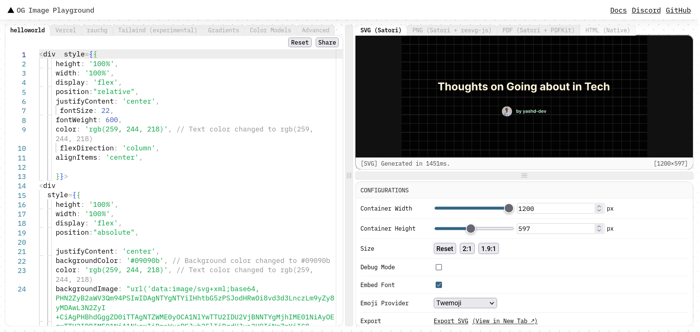

When you share on any social media platform, some websites give you that neat preview right? So what I am doing today is dynamically making those preview images ( also called Open Graph Images ) for my blogs using Satori for Astro. I am implementing this also because I'm too lazy to make OG images from scratch in Figma everytime.

I was aware of Satori and how it made SVG's from HTML and CSS and it was on my TODO list for a long time but I was procrastinating on actualy implementing until I read [this article by dietcode](https://dietcode.io/p/astro-og/). The article's imlpementation used a Astro post build hook but since I am using Server Side Rending for Vercel analytics, I'll have to modify it to run pre build because then it would be bundeled with the Vercel Adapter Build. [ Here is a quick TL;DR of my hacky implementation in Astro](https://github.com/yashd-dev/portfoliov7/blob/main/satori.js)

[Vercel's Open Graph Playground](https://og-playground.vercel.app/) is a great resource to visualize and design the image. Satori does not have the complete CSS implementation and its supposed to be written in a JSX like syntax _(although experimental TailwindCSS implementation is present)_ so using that playground to exactly visualize how the output would be is quite helpful. [Here is my implementation](https://og-playground.vercel.app/?share=tVVtb9o6FP4rlq-u2qlZ8wL0Qm47iZfekqml3JauKuKLE5vELLGjxCGEiv--YxLotE7avgwUR-fFPo-e8xznFQeSMuziS8rXCOWqitnV6-tCIPhFjIeRctGJbVl_nxi1s-RURT_4KM_TmFTgXcZsc_CmMueKS-EucMZioviaLXATWxW54stqKIViQpcI4MWyw1a0hMAj3zIXOU7j067nBtGFZTXeQMYyg_1Z6J86nZ6BnHYbFrv74cRApolmbKPqJBRERISMIiXR--xDXcA_4hkL9sABloyLRBxgkZiHwlMsyd8hrtfd7tNCaCq1-afIJH4OqFRD5m_x6ZPga5jJQtBhw9dfVg_-fk3S4Bh-T1WT-CfYfkPlJSSEXi9wkcWnJ5Qo4nLtMvN1eLZJ4n99krOLtjEdT5x5NXDI85fW_0mvPX30Sm_UDyezF_1wbxwp_6aznT5-lnT8UN7z7pq2aOtWBNvbpFfNq251N-qXty19jnc25P1wOh5E9CYM5yOLz2b6rPnz3bVV3Q_79iR-KWezJ8cbPTlfVoOJrnO3ijyI2xPer-6vwyY-OPjsydew9PggIc-bHHAUvtOJwd7S8ec1cZ56Hp8k8wSwDrtnw1W5DlpzMQ2vrk4-HKfjjZj9DCxw9yLdIL38JGX6poy66cg6Zi15DA6IID_T8hMsz0-tc-dYqk7beoKyjfux19P2brcQWsYm6Bje6DI9ShklJAu5mMnURW0LGd_Naccx3kkXpYRSLkLXtoyfDo8emFkkC4CWIynQjYRsRHxZKMQFyCmI0KWZftrj_B7Hj5V-Vcg4aBfuIlCj3bVBiA5I0u5dABn14GoqLnkSojwLrhY4UirNXdOsSB7RcwVYzL0oc7OMuGLnqzSEnSRWkPuic8A6AvRlRln2QCgvNIx6wI_z3rFSTc_xTmhs6a_g5vmPgwuaKdcsgz41nD_sUx0LoCKzJgRUUKE9uo-UrWuOgKy31i0ENrBMtTpy7L7ifXns2g5cn7gujt1O7x8DU-YXIXaXJM6ZgVkiV3xWpfrDoMq9BQfpXl8nPqPYVVnBdgZWxIeMiMWxLGUWU7z7Bg)

Now that we have the JSX code for generating the SVG, I'll be converting that into object that looks like transpiled JSX because I haven't installed React or any JSX Compiler. That code looks something like this:

```js
const JSX={
		type: "div",
		props: {
			children: "hello, world",
			style: { color: "black" },
		    },
        },
```

### Outline of Script

So this is what the script does,though I think you'll understand better by reading the source code. I made a `js` file in the root directory in which, first a function with the title of each post as parameters is made and it returns the transpiled JSX object with the title of the blog.

```js
const svg = (title) => ({
// This is my styling In transpiled JSX syntax. This is not the complete thing, complete thing was too big, here is a small smippet of it
type: "div",
props: {
        {
            type: "p",
            props: {
                children: title,
                style: {
                    marginTop: 40,
                    fontSize: 52,
                    display: "flex",
                    padding: 10,
                    alignItems: "center",
                },
            },
        },
    }
});
```

Then a font file is loaded as a ArrayBuffer using `fs`. We read each file in the posts directory, parse it using `grey-matter` to get the frontmatter _(Astro's content collection was not working here so grey matter it is)_. After parsing, I'll get the title of the post which will be passed to the above function and gets the transpiled JSX Object with the title. Now we call Satori and pass in our object along with other parameters like height, width and the font ArrayBuffer. Finaly, we convert the SVG to a PNG using `Resvg` and write it do the `public/og` directory as Astro doesnt touch this directory and passing this path as props would be easier.

```js
const outfit = fs.readFileSync("./Outfit-Bold.ttf"); // Font file ArrayBuffer is needed by Satori
const postsDirectory = "src/content/posts";
const files = fs.readdirSync(postsDirectory);

files.forEach(async (file) => {
	const filePath = `${postsDirectory}/${file}`;
	const fileContent = fs.readFileSync(filePath, "utf-8");
	const title = parseFrontmatter(fileContent).data; // just reading and parsing each post to get frontmatter of each to pass on to our above styled div
	const output = await satori(svg(title.title), {
		width: 1200,
		height: 430,
		fonts: [
			{
				name: "Outfit",
				data: outfit,
				weight: 700,
				style: "bold",
			},
		],
	});
	const resvg = new Resvg(output, {
		// converting to PNG's
		fitTo: {
			mode: "width",
			value: 1200,
		},
	});
	fs.writeFileSync(
		`public/og/${slugify(title.title, {
			lower: true,
			trim: true,
			remove: undefined,
		})}.png`,
		resvg.render().asPng()
	);
});
```

Now that we have our little script ready, I made the `public/og` directory and modified the `package.json` to include our script before the build.

```js
"scripts": {
    "build": "node satori.js && astro check && astro build",
},
```

All that's left is passing the Open Graph Content to the Layout file like this:

```js
//This is Layout.astro accepting the prop
---
const { imgurl, title, description } = Astro.props;
---

<meta property="og:title" content={title} />
<meta property="og:description" content={description} />
<meta property="og:image" content={imgurl} />
```

```js
// This is the slug.astro, passing the props
<Layout
	title={entry.data.title}
	imgurl=`https://yashd.tech/og/${slugify(entry.data.title, {
			lower: true,
			trim: true,
			remove: undefined,
		})}.png`
	description={entry.data.description}
></Layout>
```

### Improvements that can be made

Currently the script is generating the images that were previously generated once more and overiding the previous version just adding time and increasing computation. Right now I'm hosted on Vercel so build times are not my worries and my blogs right now are at a very small scale, once they reach bigger, the script will be revisited and improvised.

